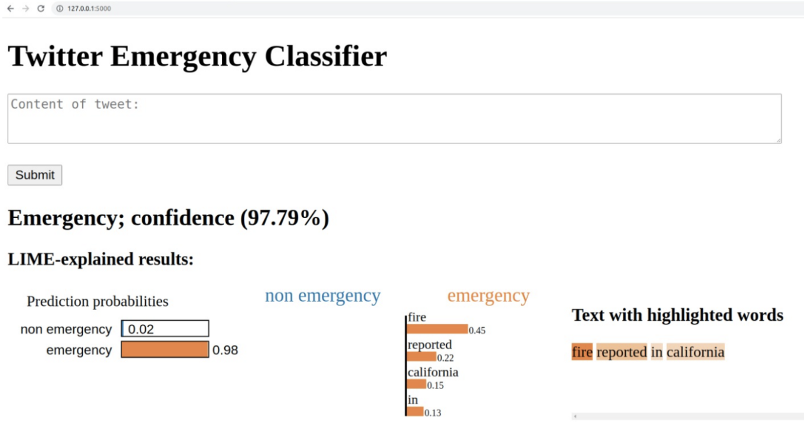
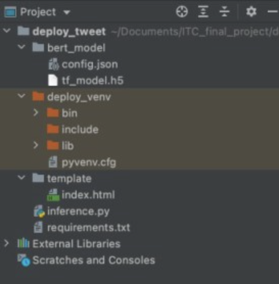

# Emergency Tweet Classification and BERT Model Deployment
October, 2021

In colaboration with Maor Ronen and Magen Lahat

https://medium.com/@imisri1/emergency-tweet-classification-and-model-deployment-94c88e86981c



We have implemented a BERT model that classifies whether a tweet
is an emergency or not. The model was trained on a dataset
provided by Kaggle as part of a competition 
(https://www.kaggle.com/c/nlp-getting-started).

We then create an API with Flask to deploy the model locally.

## Setup
1. Download python or ensure that you have the latest version of 
python installed. For optimal use ensure you have python 3.9 or a 
   later version
2. Open the terminal or command line interface
3. Go to the directory where the this project is saved 
4. Use the package manager pip to install packages using 
requirements.txt
    ```console
    pip install -r requirements.txt
    ```
5. The BERT.ipynb notebook should be run on Google Colab. 
   2 files will be created (BERT_model.h5 and config.json).
   Download both of them onto your local drive and place them
   in the bert_model directory




